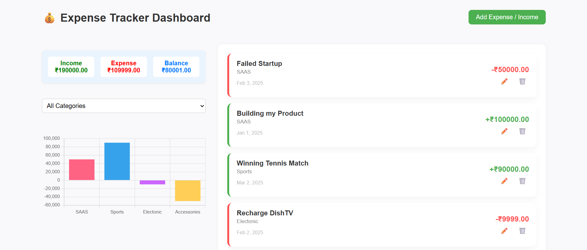

# 💸 Expense Tracker Dashboard (Svelte)

Track your expenses and incomes in a beautiful, minimal, and interactive dashboard built with **Svelte**. Categorize, filter, edit, and visualize your financial activity with a bar chart.



---

## 🔧 Features

- 📥 Add income and expense records
- 📝 Edit or delete entries
- 📊 Interactive category-wise bar chart
- 🧮 Real-time summary (Income, Expense, Balance)
- 🔍 Filter by category
- 💅 Clean and responsive UI with modern design
- 🧠 Uses Svelte stores for state management

---

## 🚀 Tech Stack

- **Svelte**
- **JavaScript**
- **Svelte Stores**
- **Recharts / Chart.js** (for data visualization)
- **CSS** (custom styling, flexbox/grid layout)

---

## 📦 Setup

```bash
# Clone the repo
git clone https://github.com/your-username/svelte-expense-tracker.git
cd svelte-expense-tracker

# Install dependencies
npm install

# Run the dev server
npm run dev
